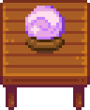

# Crystal Ball

Adds a crystal ball that changes color depending on your daily luck. You can carry it around or set it down on a table.

To acquire the recipe, attain eight hearts with the Wizard. You will receive a letter the next day with the recipe attached.

## Dependencies

This mod requires the following other mods installed in order to run.

- [SMAPI](https://smapi.io/).
- [JSON Assets](https://www.nexusmods.com/stardewvalley/mods/1720).
- [Content Patcher](https://www.nexusmods.com/stardewvalley/mods/1915).
- [Mail Framework Mod](https://www.nexusmods.com/stardewvalley/mods/1536).

## Installation

Download the zipfile, unzip it, and place the Crystal Ball directory in your Mods directory.

## About

This mod is available under the terms of the MIT license.

The crystal ball sprites were created by Mary Helen Perot.
